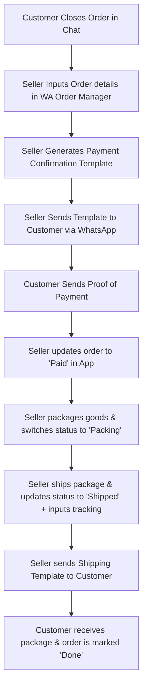
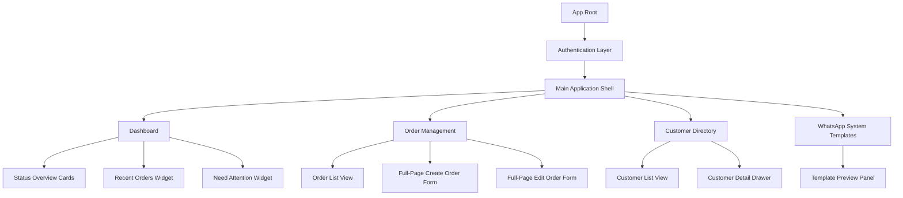
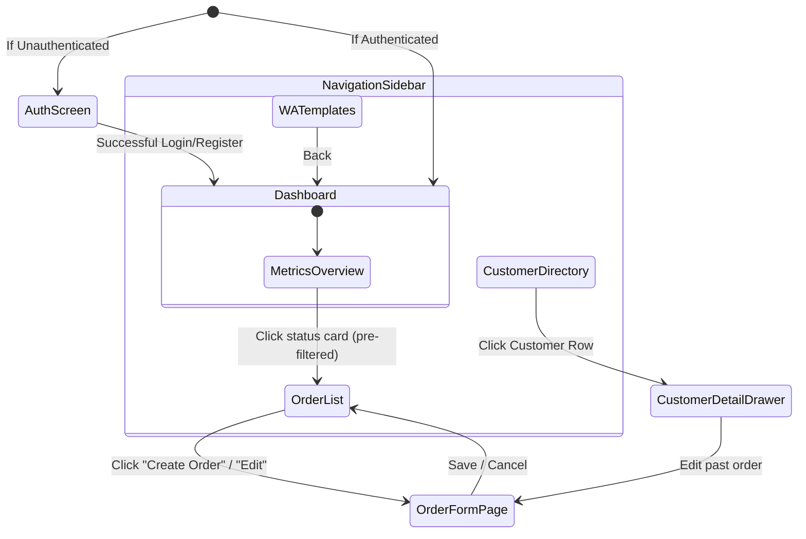
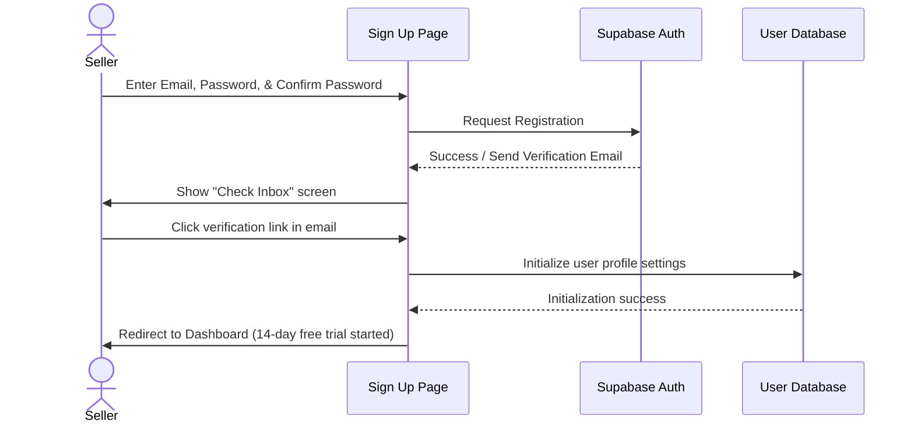
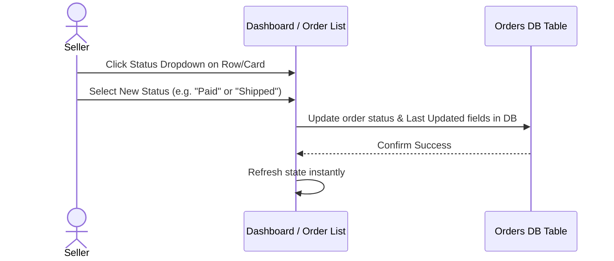
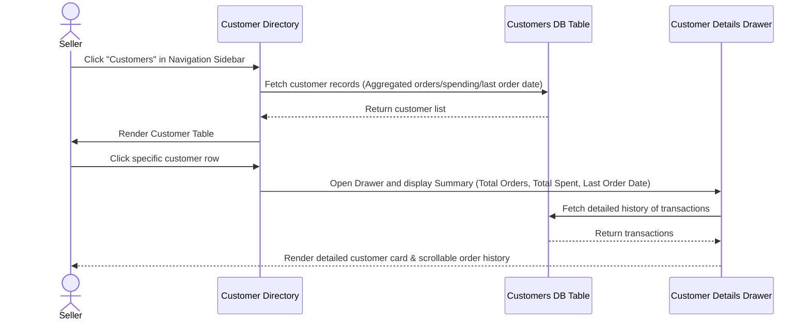
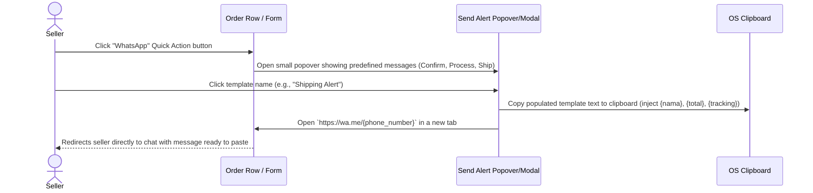

# WA Order Manager — MVP v1 Product Specification (Revised)

## Executive Summary
This document outlines the revised product specification, user personas, information architecture, screen definitions, and key user flows for **WA Order Manager v1**. 
The application acts as an operational tracking tool for post-sale order processing, optimized for speed, scan-readability, and maximum layout density.

---

## 1. Core User Personas

Based on target user profiles, we identify two primary archetypes representing the majority of the user base:

### Persona A: "The Solo Crafter / Home Baker" (Ibu Nur, 34)
* **Context**: Sells homemade cakes and snacks via Instagram and WhatsApp. Pre-order (PO) system is common. Handles kitchen production and customer communications herself.
* **Core Pain Points**: 
  - Forgets which customer has paid versus who is still pending.
  - Loses track of which orders need to be prepared/baked for which day.
  - Spends hours copying and pasting bank details or order confirmations back and forth in chat.
* **Success for Nur**: A clean checklist on her phone/laptop showing exactly what she needs to cook today, and who needs a payment reminder.

### Persona B: "The High-Volume Reseller" (Budi, 24)
* **Context**: Resells fashion/accessories imported from suppliers. Promotes via TikTok Shop and drives transactions to WhatsApp for personalized service.
* **Core Pain Points**: 
  - Managing shipping details and receipts for dozens of packages daily.
  - Finding a customer's purchase history when they ask "where is my tracking number?".
  - Getting overwhelmed when moving order details from WhatsApp chat to Excel.
* **Success for Budi**: Instant search by customer phone number, swift status switching (e.g., from *Paid* to *Shipped*), and one-click WhatsApp message generation with tracking numbers.

---

## 2. Complete User Journey

The journey focuses on the operational workflow after the closing conversation happens.



| Phase | User Action | System Touchpoint | Friction Points |
|---|---|---|---|
| **1. Order Entry** | Seller manually inputs buyer details (Name, WA number, product, price) immediately after closing a deal in chat. | Full-Page Order Form | Copy-pasting multiple items across different fields. |
| **2. Invoice/Confirmation** | Seller triggers the Payment Confirmation WhatsApp template. | WhatsApp template generator (copy button) | Manually switching apps to paste the text back into WhatsApp. |
| **3. Verification** | Seller reviews bank transfers and marks the order as **Paid**. | Dashboard or Order List Status toggle | Matching bank statements to customer names. |
| **4. Fulfillment** | Seller prepares/packs the items and switches status to **Packing** or **Shipped**. | Order Detail / Quick Status buttons | Updating tracking numbers one-by-one. |
| **5. Post-Shipping** | Seller grabs the Shipping template containing the tracking number and posts it back to the customer on WhatsApp. | Shipping template copy tool | Typing/copying tracking numbers back into the WhatsApp thread. |

---

## 3. Revised Information Architecture (IA)

The v1 Information Architecture is optimized for speed and operational monitoring.



---

## 4. Screen Definitions (Revised MVP v1)

A total of **6 key screens** are required for the MVP:

1. **Sign In & Sign Up Screen**: Split-pane screen containing simple email/password credentials input.
2. **Dashboard Screen**: The primary homepage displaying key metrics (Total Orders, Pending Payment, Paid, Packing, Shipped, Done), a **Recent Orders** list (Customer Name, Order ID, Status, Last Updated), and a **Need Attention** widget (stuck orders, missing tracking).
3. **Order List Screen**: A searchable table of all orders with filters for Status, sorting, and direct Quick Actions (WhatsApp text generation, Edit, Delete) in each row.
4. **Full-Page Order Form Screen**: A dedicated page for inputting order information (Customer Name, Phone Number, Product Name, Quantity, Total Price, Notes, Status, and optional Tracking Number). Designed for scalable future fields.
5. **Customer Directory Screen**: A directory of unique customers compiled automatically from order entries. Shows WhatsApp numbers, total orders, and total spending.
6. **WhatsApp Templates Preview Screen**: A view of predefined, system-managed templates (Payment Confirmation, Processing, Shipping). Read-only for MVP v1.

---

## 5. Screen Relationships and Navigation



---

## 6. Revised User Flows

### Flow A: Registration


### Flow B: Creating an Order (Full-Page)
```mermaid
sequenceDiagram
    actor Seller
    participant List as Order List Screen
    participant FormPage as Full-Page Order Form
    participant DB as Orders DB Table
    participant CustDB as Customers DB Table

    Seller->>List: Click "Create Order"
    List->>FormPage: Navigate to /orders/new
    Seller->>FormPage: Fill Name, WA Number, Product, Qty, Total Price, Status, Tracking No., Notes
    Seller->>FormPage: Click "Save Order"
    FormPage->>DB: Insert new order row
    FormPage->>CustDB: Check if WA Number exists. If new, create customer; if exists, update totals & Last Order Date.
    DB-->>FormPage: Confirm Save
    FormPage->>List: Navigate back to /orders & Refresh list
```

### Flow C: Updating Order Status


### Flow D: Viewing Customers & Summary


### Flow E: Using Predefined WhatsApp Templates

